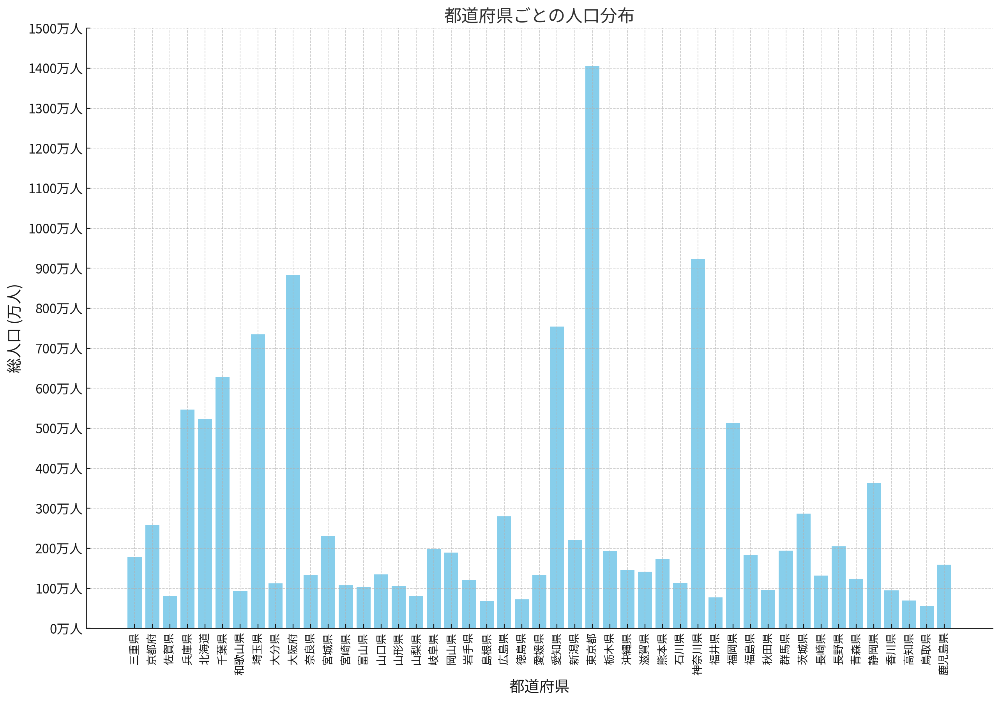
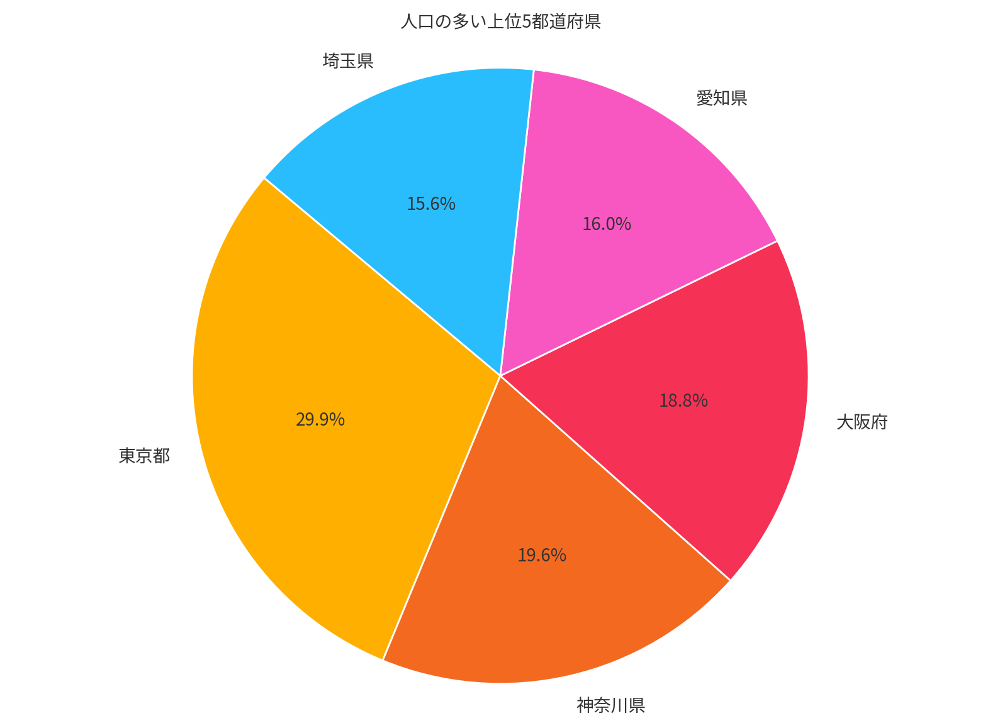

# Chat AssistantAPI (Python)

このプロジェクトは、OpenAI AssistantAPI を使用してアップロードしたファイルを解析し、インタラクティブにユーザーの質問に答える AI アシスタントです。EXCELファイルと日本語フォントを ZIP 形式でアップロードし、日本語対応したチャートやグラフを作成するシナリオの検証用途として作成されています。

## チャット例

- アップロードしたファイルに含まれる EXCEL シートを読み取り、都道府県の人口分布を縦棒のグラフで出力してください。人口数を表す縦のメモリは 100 万人単位で表示してください。

    

- アップロードしたファイルに含まれる EXCEL シートを読み取り、人口の多い都道府県の上位5件を円グラフで表し、割合をパーセンテージで示してください。

    

## 制約事項

AssistantAPI は現在プレビューであり、日本語フォントをアップロードし利用するシナリオにおいては、以下の環境で安定稼働する事を確認してています。

- REGION (Glbal Standard) : `eastus2`
- GPT-4o モデル バージョン : `2024-05-13`
- API_VERSION : `2024-05-01-preview`

## セットアップ

1. Python 仮想環境を作成し、アクティブにします。

    ```sh
    python -m venv venv
    source venv/bin/activate  # Windows の場合は `venv\Scripts\activate`
    ```

2. 必要なパッケージをインストールします。

    ```sh
    pip install -r requirements.txt
    ```

3. [.env](http://_vscodecontentref_/5) ファイルを作成し、必要な環境変数を設定します。

    ```plaintext
    AZURE_OPENAI_ENDPOINT="https://your-openai-endpoint"
    AZURE_OPENAI_API_KEY="your-api-key"
    API_VERSION="2024-05-01-preview"
    DEPLOYMENT_NAME="your-deployment-name"
    ```

## 使用方法

1. スクリプトを実行します。

    ```sh
    python main.py
    ```

2. プロンプトに従ってユーザー入力を行います。終了するには `exit` と入力します。

## デバッグ

VSCode を使用してデバッグするには、`.vscode/launch.json` ファイルを使用します。VSCode のデバッグタブで `Python Debugger: main.py` 構成を選択し、デバッグを開始します。